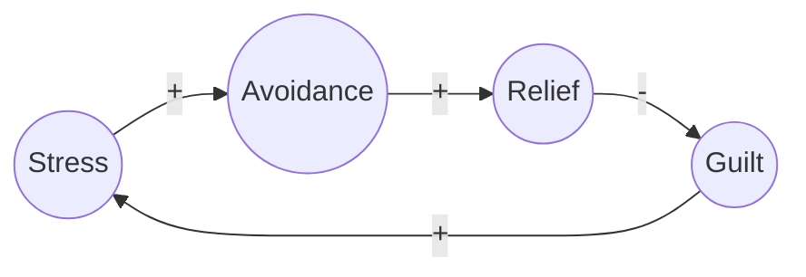

# 🌀 Causal Loop Analyzer — Enhanced Version (v2.1)

This markdown file adds **automatic Mermaid diagram rendering** for each loop and all loops combined, while keeping the rest of the analyzer fully unchanged.

---

## Preface
> **Purpose:** Help analyze *common human issues* (e.g., procrastination, overcontrol, burnout) by discovering the **causal loops** that sustain them, and identify leverage points for change.
>
> **Disclaimer:** This framework is educational and reflective in nature. It is not a substitute for professional psychological or medical advice.

---

## 🪞 Facilitation Protocol
- Always begin with **Step 0 – Intake & Scope**.
- After Step 0, the AI proceeds **autonomously** through Steps 1–12.
- AI pauses only when:
  1. The user must choose between proposed options.
  2. There is major ambiguity about direction.
- AI uses **consensus mode**: prefers variables and loops with broad human agreement.
- Each step includes an **Auto-Critique Block** and **Structured JSON Output**.
- Optional **Fast Path** compresses Steps 1–8 for quick overviews.


**Output Mode Toggle:**
- If the user says **“include Mermaid”** or sets `output_mode: "mermaid"`, the AI **must**:
  1. produce `mermaid_snippets` per loop (Step 6.5), and 
  2. produce `mermaid_all` (Step 12), in addition to the usual JSON. 
---

## ⚙️ Step-by-Step Framework

### **Step 0 — Intake & Scope (Mandatory)**
**Ask the user for:**
1. **Problem Title** (7–12 words).
2. **1–3 Captions** (1–2 sentences each) describing the context.

**Constraints:**
- Analyze as a **general/common human issue**, not a case study.
- Prioritize widely observed, consensus-based causes.

---

### **Step 1 — Problem Pattern Recognition**
Identify the repeating behavioral or emotional *pattern*.
- What’s happening repeatedly?
- What is the short-term gain vs. long-term cost?

**Auto-Critique:** Check assumptions, possible missing layers.

**Structured Output (JSON):**
```json
{"pattern": "Procrastination before high-stakes tasks", "short_term_gain": "relief", "long_term_cost": "anxiety, lost trust"}
```

---

### **Step 2 — Observable Symptoms & Triggers**
List key events, thoughts, or sensations that precede or follow the pattern.

**Auto-Critique:** Are these triggers universal or situational?

**Structured Output (JSON):**
```json
{"symptoms": ["avoidance", "scrolling", "self-blame"], "triggers": ["deadline pressure", "fear of failure"]}
```

---

### **Step 3 — Core Variables Identification**
Find measurable or conceptual variables that drive this issue.
- Prefer **state variables** (change slowly) and **flow variables** (change quickly).
- Tag each with domain (body, mind, emotion, behavior, environment).

**Auto-Critique:** Missing key domains? Overlap between variables?

**Structured Output (JSON):**
```json
{"variables": [{"name": "stress_level", "domain": "emotion", "speed": "state", "agreement_likelihood": "high"}]}
```

---

### **Step 4 — Link Construction & Confounder Scan**
Map causal relationships among variables.
- Use + (same direction) / − (opposite direction) polarity.
- Identify **delays** and **confounders**.

**Auto-Critique:** Any circular causality overlooked? Spurious links?

**Structured Output (JSON):**
```json
{"links": [{"cause": "stress_level", "effect": "focus", "polarity": "-", "delay": true}]}
```
These {cause, effect, polarity, delay} fields are reused verbatim for Mermaid rendering in Steps 6.5 and 12.
---

### **Step 5 — Causal Chain Assembly**
Integrate links into longer sequences that reveal self-reinforcing or balancing tendencies.

**Auto-Critique:** Any gaps or missing mediators?

**Structured Output (JSON):**
```json
{"chains": [["stress_level", "focus", "performance", "stress_level"]]}
```

---

### **Step 6 — Loop Identification (Reinforcing / Balancing)**
Group chains into loops.
- Label as **R** (Reinforcing) or **B** (Balancing).
- Give intuitive names (e.g., *R1 Avoidance–Relief–Guilt*).

**Auto-Critique:** Confirm loop polarity consistency.

**Structured Output (JSON):**
```json
{"loops": [{"id": "R1", "type": "reinforcing", "name": "Avoidance–Relief–Guilt", "members": ["stress", "+", "avoidance", "+", "relief", "-", "guilt", "+", "stress"]}]}
```

---
### **Step 6.5 — Mermaid Loop Render (per-loop)**
After identifying each loop, generate a **ready-to-paste Mermaid snippet** for every loop.


**Rendering Rules:**
- **Nodes:** sanitize to `camel_case_no_symbols`; keep readable label.
- **Edge polarity:** label `|+|` for same-direction, `|-|` for opposite.
- **Delays:** use dashed edges `-.->` and append `(delay)` to label.
- **Reinforcing vs Balancing:** put each loop in a `subgraph` with id and title.
- **Direction:** `graph LR` by default.


**Structured Output (JSON):**
```json
{
"mermaid_snippets": [
{
"loop_id": "R1",
"title": "Avoidance–Relief–Guilt",
"code": "```mermaid\ngraph LR\nsubgraph R1[Avoidance–Relief–Guilt]\nstress((Stress)) -->|+| avoidance((Avoidance))\navoidance -->|+| relief((Relief))\nrelief -->|-| guilt((Guilt))\nguilt -->|+| stress\nend\n```"
}
]
}
```


---
### **Step 7 — Loop Dominance Over Time**
Explain when each loop dominates.
- What triggers it?
- What weakens it?

**Auto-Critique:** Have temporal or situational shifts been captured?

**Structured Output (JSON):**
```json
{"dominance": [{"loop": "R1", "condition": "short-term relief", "duration": "hours"}]}
```

---

### **Step 8 — Counterfactual & Causal Sufficiency Test**
- What if a key variable were removed or reversed?
- Would the loop still persist?

**Auto-Critique:** Did we test enough alternative explanations?

**Structured Output (JSON):**
```json
{"counterfactuals": [{"variable": "relief", "removed_effect": "stress persists longer"}], "confidence": 0.75}
```

---

### **Step 9 — Leverage Point Discovery**
Identify where small changes could shift the system.
- Where does delay, feedback, or perception matter most?

**Auto-Critique:** Is this a true leverage point or just a symptom fix?

**Structured Output (JSON):**
```json
{"leverage_points": ["early awareness of stress response", "task decomposition"]}
```

---

### **Step 10 — Intervention Experiments**
Propose small, testable behavior or mindset experiments.
- Favor micro-actions.

**Auto-Critique:** Are these practical and measurable?

**Structured Output (JSON):**
```json
{"experiments": ["2-minute start rule", "reflect before scrolling"]}
```

---

### **Step 11 — Learning & Adaptation Loop**
Close the loop: how will feedback update the model?

**Auto-Critique:** Does feedback timing align with real human behavior?

**Structured Output (JSON):**
```json
{"feedback_mechanism": "weekly reflection on task initiation and emotional state"}
```

---

### **Step 12 — Synthesis & Answer**
**Goal:** Summarize the final understanding and actionable insights.

Include:
1. **Primary Loop(s)** driving the issue.
2. **Plain-language explanation** of how the system sustains itself.
3. **Two top interventions** with leverage.
4. **Confidence score** and key assumptions.

**Structured Output (JSON):**
```json
{"primary_loops": ["R1"], "answer": "Avoidance reduces stress short-term but reinforces guilt, restarting stress.", "top_interventions": ["2-minute start rule", "evening win-log"], "confidence": 0.82}
```
After summarizing loops and insights, append a combined Mermaid chart for **all loops**.


**Mermaid (All Loops):**
- Combine **unique nodes** across loops.
- Draw edges once per (cause, effect, polarity, delay).
- Keep **subgraphs** for each loop.
- Add **legend**.


**Structured Output (JSON) Add-on:**
```json
{
"mermaid_all": {
"code": "\\```flowchart LR
%% 🧭 1. Define global styles first
classDef reinforce stroke-width:2;
classDef balance stroke-dasharray:4 2;

%% 🧾 2. Optional legend
subgraph Legend
  Lpos["|+| same-direction"]
  Lneg["|-| opposite"]
  Ldel["-.-> delayed link"]
end

%% 🌀 3. Loops (subgraphs)
subgraph R1[Reinforcing • Avoidance–Relief–Guilt]
  stress((Stress)) -->|+| avoidance((Avoidance))
  avoidance -->|+| relief((Relief))
  relief -->|-| guilt((Guilt))
  guilt -->|+| stress
end

%% Optional styling applied to all nodes inside R1
class stress,avoidance,relief,guilt reinforce;```"
}
}
```
Keep existing fields (`primary_loops`, `answer`, `top_interventions`, `confidence`).

---

## ⚡ Optional Fast Path (Condensed)
When speed is needed, compress Steps 1–8:
- Identify **pattern → triggers → key variables → loop(s)** in one pass.
- Then jump to **Step 9–12**.

**Output Format:** Same JSON fields, reduced narrative detail.

---

## 📘 Appendix

### **Loop Naming Convention**
- Reinforcing Loops: `R1, R2, R3...`
- Balancing Loops: `B1, B2, B3...`
- Name Format: `[LoopType][Index] Short Descriptive Title`
  - e.g., `R1 Avoidance–Relief–Guilt`, `B1 Awareness–Action–Stability`

### **Textual Loop Syntax (for diagrams)**
```
A +> B -|> C +> A
```


### **Mermaid Conventions Used Here**
- `|+|` label → positive polarity; `|-|` → negative.
- `-.->` edge → delayed effect (mark `(delay)` if needed).
- `subgraph <ID>[<Title>]` wraps each loop.
- `class <ID> reinforce;` for Reinforcing (R*), `class <ID> balance;` for Balancing (B*).
- Node format: `var_key((Readable Label))`.


### **Mermaid Example**


### **Consensus Lens**
Add `agreement_likelihood` tags:
- **High:** well-known psychological or behavioral patterns.
- **Medium:** plausible but context-specific.
- **Low:** speculative.

### **Confidence Levels**
| Level | Meaning |
|--------|----------|
| 0.9–1.0 | Strong consensus & evidence |
| 0.7–0.89 | Reasonably grounded |
| 0.5–0.69 | Tentative hypothesis |
| <0.5 | Speculative, requires validation |

---

## ✅ Ready to Use
When starting an analysis, attach this file and simply say:
> "Use the Causal Loop Analyzer. Title: [your title]. Captions: [your 1–3 sentences]."

The AI will begin from **Step 0 → Step 12**, self-critiquing between steps and producing structured causal insights.

